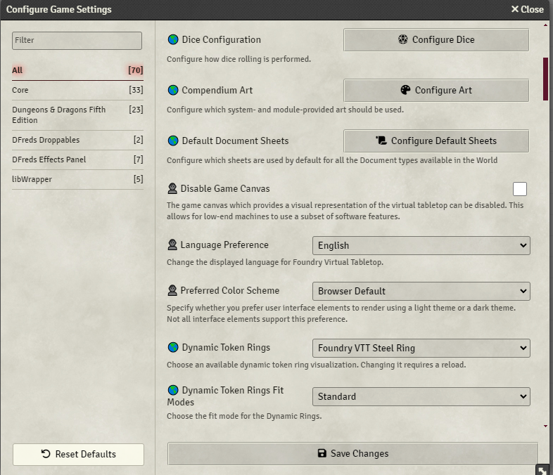

  

<h1 align="center">DFreds Obvious Settings</h1>

<h4 align="center">
  <a href="https://foundryvtt.com/packages/dfreds-obvious-settings">Install</a>
  ·
  <a href="https://discord.gg/Wq8AEV9bWb">Discord</a>
  ·
  <a href="https://github.com/topics/dfreds-modules">Other Modules</a>
</h4>

    
    
    
     
     
    
    
     
    
    
     
     
    
    
    

    <b>DFreds Obvious Settings</b> is a FoundryVTT module that indicates if a setting is a world or client scope.

## Let Me Sell You This

When setting up your new game, isn't it a bit confusing which settings will
impact players, and which settings will only impact yourself? Well, now you
don't need to be confused.

## What This Module Does

This module adds a 🌎 icon before settings scoped to "world" (will be set for
all players) and a 👤 icon before settings scoped to "client" (personal settings
per user).

## Required Modules

- [libWrapper](https://foundryvtt.com/packages/lib-wrapper) by ruipin - A
  library that wraps core Foundry methods to make it easier for modules
  developers to do their thang. Note that if you for some reason don't want to
  install this, a shim will be used instead. You'll be pestered to install it
  though so... [just do it](https://www.youtube.com/watch?v=ZXsQAXx_ao0).
