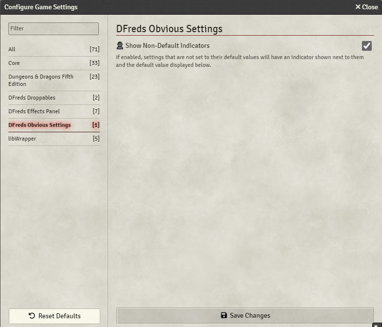

# DFreds Settings Clarity

**DFreds Settings Clarity** is a FoundryVTT module that indicates if a setting is a world or client scope.

## Let Me Sell You This

When setting up your new game, isn't it a bit confusing which settings will
impact players, and which settings will only impact yourself? Well, now you
don't need to be confused.

## What This Module Does

This module adds a 🌎 icon before settings scoped to "world" (will be set for
all players) and a 👤 icon before settings scoped to "client" (personal settings
per user).

## Required Modules

- [libWrapper](https://foundryvtt.com/packages/lib-wrapper) by ruipin - A
  library that wraps core Foundry methods to make it easier for modules
  developers to do their thang. Note that if you for some reason don't want to
  install this, a shim will be used instead. You'll be pestered to install it
  though so... [just do it](https://www.youtube.com/watch?v=ZXsQAXx_ao0).

## This Looks Familiar

A similar module used to exist maintained by DragonFlagon called DF Settings
Clarity. This is the continuation of that helpful module after it was abandoned.
And hey! The module name includes a whole extra "reds" in it now.
